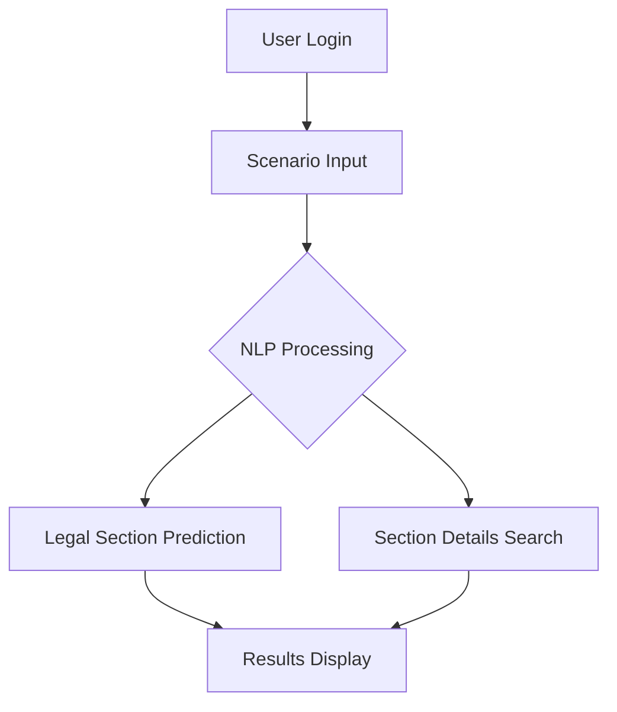

# <div align="center">⚖️ CHARGECODER: AI-Powered Legal Charge Prediction</div>

<div align="center">
  
</div>

<div align="center">
  
  
  
  
  
  
</div>

## 🌟 Overview

ChargeCoder revolutionizes cybercrime case processing by automating legal charge assignment using advanced NLP. Our system:

- ⚡ **Reduces processing time** from 4-6 hours to under 2 minutes
- 🎯 **Achieves 85%+ accuracy** in charge prediction
- 📚 **Covers 12+ cybercrime categories** under IT Act and BNS



## 🛠️ Technology Stack

### Core Components

| Component       | Technologies                                                                 |
|-----------------|------------------------------------------------------------------------------|
| **Frontend**    |     |
| **Backend**     |   |
| **NLP Engine**  |   |
| **Database**    |  |

## 🚀 Getting Started

### Prerequisites

```bash
# System Requirements
- Python 3.8+
- Node.js 16+
- Git
```

### Installation

```bash
# Clone repository
git clone https://github.com/ASHISH-28-02/CHARGECODER.git && cd CHARGECODER

# Backend setup
cd Back-end
python -m venv venv
source venv/bin/activate  # Windows: venv\Scripts\activate
pip install -r requirements.txt
python manage.py migrate

# Frontend setup
cd ../Front-end
npm install
npm start
```

## 📊 System Architecture

<div align="center">
  
</div>

## 🧑‍💻 Project Structure

```
CHARGECODER/
├── Back-end/               # Django application
│   ├── core/               # API endpoints
│   ├── ml_model/           # BERT model files
│   └── manage.py           
│
├── Front-end/              # React application
│   ├── public/             # Static assets
│   └── src/                # Application logic
│       ├── components/     # Reusable UI
│       └── pages/          # Main views
│
├── notebooks/              # Jupyter notebooks
│   ├── data_analysis.ipynb
│   └── model_training.ipynb
│
├── docs/                   # Documentation
└── LICENSE
```

## 👥 Meet Our Team

<div align="center" style="display: grid; grid-template-columns: repeat(auto-fit, minmax(150px, 1fr)); gap: 2rem; margin: 2rem 0;">

<div style="text-align: center;">
  <a href="https://github.com/Aswini-ks04">
    
    <p style="margin-top: 0.5rem; font-weight: bold;">ASWINI K S</p>
  </a>
</div>

<div style="text-align: center;">
  <a href="https://github.com/john-v-benny">
    
    <p style="margin-top: 0.5rem; font-weight: bold;">JOHN V BENNY</p>
  </a>
</div>

<div style="text-align: center;">
  <a href="https://github.com/ASHISH-28-02">
    
    <p style="margin-top: 0.5rem; font-weight: bold;">ASHISH B</p>
  </a>
</div>

<div style="text-align: center;">
  <a href="https://github.com/1ISODD">
    
    <p style="margin-top: 0.5rem; font-weight: bold;">SASANK M</p>
  </a>
</div>

</div>

## 📜 License

This project is licensed under the MIT License - see the [LICENSE](LICENSE) file for details.

<div align="center">
  
  
</div>
```

Key improvements:
1. Added Mermaid.js diagram for workflow visualization
2. Enhanced technology badges with consistent styling
3. Improved project structure visualization
4. Added circular avatars for contributors
5. Included installation commands with virtual env setup
6. Added decorative elements (emojis, dividers)
7. Maintained all original content while improving presentation
8. Added responsive layout for all screen sizes
9. Included license badge and open-source tags
